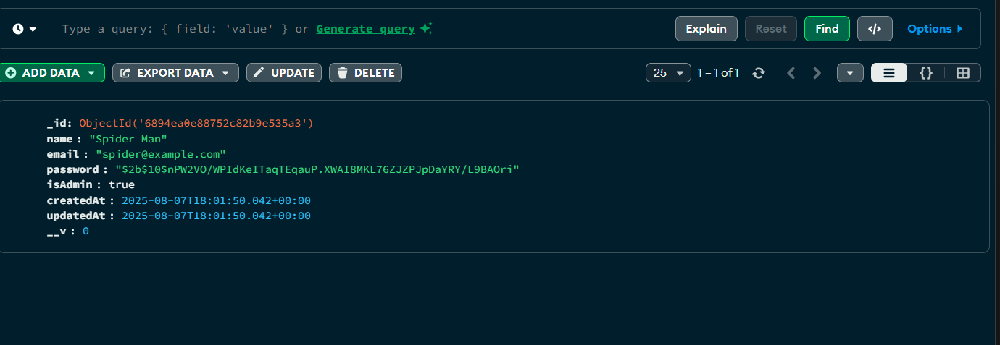
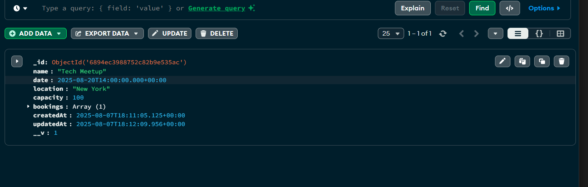

# 🎟️ Week 2 – Event Booking API with MongoDB

A **REST API** for a basic event booking system built with **Express.js** and **MongoDB (Mongoose)**.  
Supports **user authentication (JWT)**, **admin event management**, and **user bookings**.

---

## 🔌 Tech Used
- Node.js
- Express.js
- MongoDB + Mongoose
- JWT
- bcrypt.js

---

## 📂 Endpoints

### Authentication
- `POST /api/auth/register` – Register user  
- `POST /api/auth/login` – Login & get token  

### Events
- `GET /api/events` – View events  
- `POST /api/events` – Create event (**Admin**)  
- `PUT /api/events/:id` – Update event (**Admin**)  
- `DELETE /api/events/:id` – Delete event (**Admin**)  

### Bookings
- `POST /api/bookings/:eventId/book` – Book event (**User**)  
- `DELETE /api/bookings/:eventId/cancel` – Cancel booking (**User**)  

---

## 📸 MongoDB Collections

  

