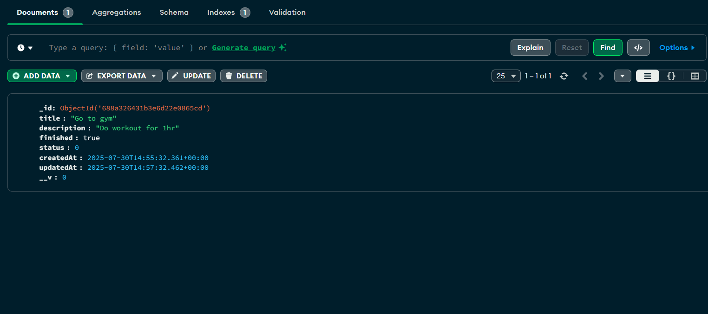
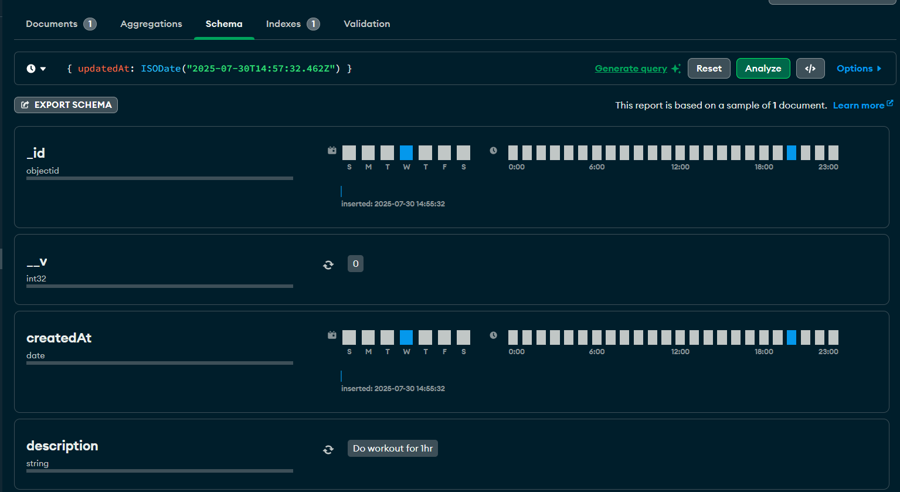

<<<<<<< HEAD
# 🗂️ Week 2 – Todo API with MongoDB

This project is a simple Todo REST API built using **Express.js** and **MongoDB (Mongoose)**. It supports creating, reading, updating, and deleting todos with a schema-based approach.

---

## 🔌 Tech Used

- Node.js
- Express.js
- MongoDB
- Mongoose

---

## 📂 Endpoints

- `GET /todos` – Fetch all todos
- `POST /todos` – Create a new todo
- `PUT /todos/:id` – Update a todo by ID
- `DELETE /todos/:id` – Delete a todo by ID

---

## ✅ MongoDB Schema Verification

A dummy Todo is added on server startup to trigger schema creation.

### 📸 Screenshot from MongoDB Compass:

=======
# 🗂️ Week 2 – Todo API with MongoDB

This project is a simple Todo REST API built using **Express.js** and **MongoDB (Mongoose)**. It supports creating, reading, updating, and deleting todos with a schema-based approach.

---

## 🔌 Tech Used

- Node.js
- Express.js
- MongoDB
- Mongoose

---

## 📂 Endpoints

- `GET /todos` – Fetch all todos
- `POST /todos` – Create a new todo
- `PUT /todos/:id` – Update a todo by ID
- `DELETE /todos/:id` – Delete a todo by ID

---

## ✅ MongoDB Schema Verification

A dummy Todo is added on server startup to trigger schema creation.

### 📸 Screenshot from MongoDB Compass/Atlas:

>>>>>>> 4fc0c75 (Updated Readme and screenshots name)
